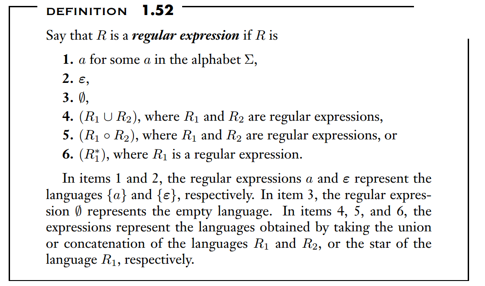
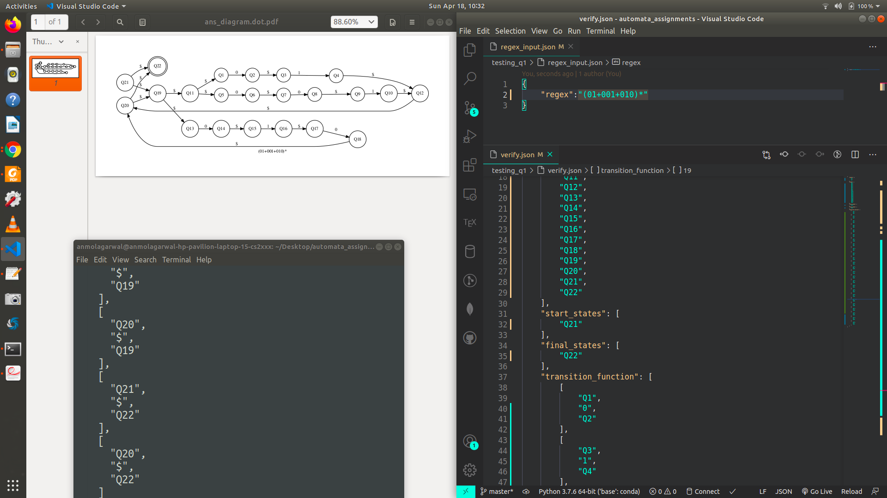
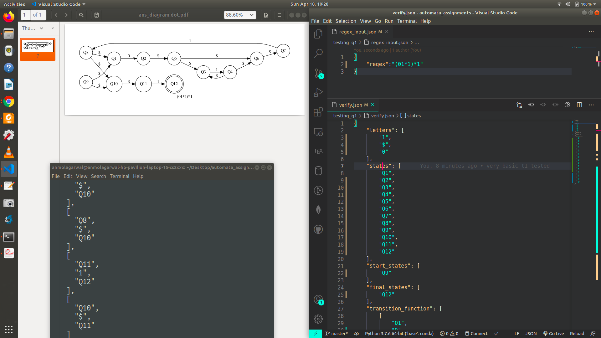
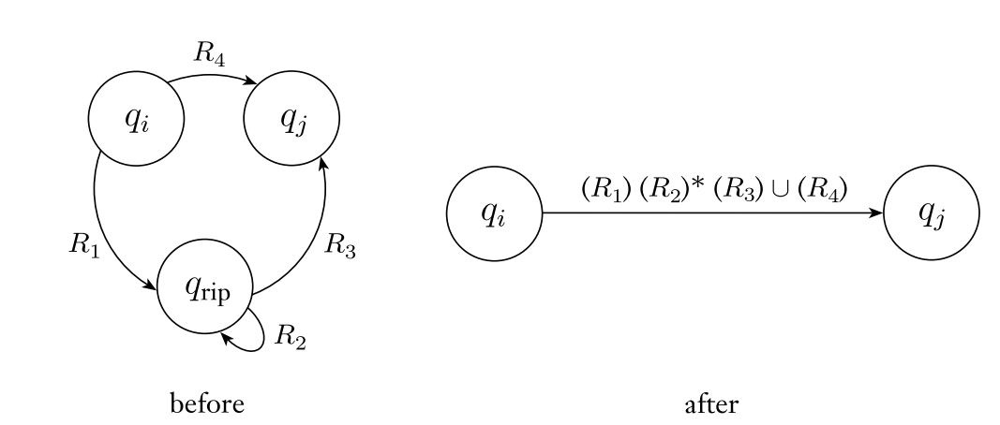

# Automata Theory Programming Assignment

- ANMOL AGARWAL, 2019101068

### **Q1 (Regex to NFA)**

**[https://drive.google.com/file/d/1shvAEBCGs37TBwbc-uNkZCV_VezMSjvd/view?usp=sharing](https://drive.google.com/file/d/1shvAEBCGs37TBwbc-uNkZCV_VezMSjvd/view?usp=sharing)**

- I first parse the regex to make **brief validity checks**. These checks include making sure that substrings like (a+b+) do not occur. Also, I add concatenation operators ‘.’ everywhere even though its presence is obvious to a human reader. The adding of concatenation operators is needed for conversion from regex to NFA in the later part of my program.
- I build several composition NFAs during the process with the **invariant** that **each child NFA will have exactly one start and accept state**
- A function called ‘check_precedence’ checks if an operator can currently be applied or should it wait for some more tokens to be read
- When a closing bracket is encountered , if the expression within the brackets is still not fully contained within a single NFA, then I complete the computations here to represent the bracket content within a single child NFA.
- I use the constructions used to prove that regular languages are closed under star, union and concatenation to make the NFA in my code. The three operators’ operations can be found in the ‘apply_union()’, ‘apply_concatenation()’ and ‘apply_kleene_star()’ functions.
- The set of letters also includes EPSILON.
- My code is **well-commented**.
- I assume that ‘’, ‘()’, `(())` are not valid regexes for conversion to NFA and should have been ‘ε’, ‘(ε)’, `((ε))` instead in case such a language needs to be represented. I claim this from the definition of regular expressions mentioned in Sipser.

> 

- My code also prepares a graphical version of my output using python’s **graphviz** library (this helped me to run several test cases and check the correctness of my program **quicker**). Currently, the graph code is commented but if a graph needs to be seen, only the ‘show_visual()’ line at the bottom of my code needs to be uncommented.

### **Q2 (epsilon-NFA to DFA)**

[https://drive.google.com/file/d/1t-W1eVd_wCNAP9PaGy8WQUawhDPI5_5j/view?usp=sharing](https://drive.google.com/file/d/1t-W1eVd_wCNAP9PaGy8WQUawhDPI5_5j/view?usp=sharing)

- **NOTE:** I have dealt with epsilon closure as well

**Approach : I have used bitwise operations at multiple place**

- Letters: exactly same for both nfa and dfa
- States: For DFA, states is the power set of set of states in NFA
- Start_state: If NFA has start state `q`, start state in DFA is **[epsilon closure of ‘q’]**
- Final_state: Of all the states in the DFA, a state is also being considered a final state if it includes at least one of the final states of the NFA. This has been implemented using bitwise operations
- Transition function: Let's say a state in my DFA is Q={q1, q2, q3.., q2}. For each <q_i, ch, q_dest> tuple where `ch` is a part of ‘letters’, I find the epsilon closure of q_dest and involve it in the destination for my <Q,ch> transition.

### **Q3 (DFA->regex) [my code deals with epsilon NFA->REGEX]**

[https://drive.google.com/file/d/1TreKxe-xaGtbGOWrlG9_0ge_lh7f7CSi/view?usp=sharing](https://drive.google.com/file/d/1TreKxe-xaGtbGOWrlG9_0ge_lh7f7CSi/view?usp=sharing)

- Even though the question inputs a DFA, **my code can handle NFA (with epsilon transitions)** as well. I have coded epsilon-NFA->regex essentially.
- Due to the epsilon-NFA, my code can handle more possibilities than is required by the assignment. BUT, as a result, the regex produced contains some extra (valid) brackets and epsilons here and there.
- The below image summarizes the manner in which I combine regexes to reduce states in my NFA

- Before any processing, I make sure (and even add additional states if needed) to make sure that my NFA is a valid GNFA that follows:
    - Start state has no incoming edges
    - Accept state has no outgoing edges
    - Though in a valid GNFA, start state has outgoing edges to every state (even if the character is NULL), I implement this in the following manner: I do not store these edges represented by NULL, but I do consider them as NULL while removing states.
- When a state is removed, I remove it from the final state list (if it were present) and also delete the edges in the transition function which involves this state.

### **Q4 (DFA minimization)**

[https://drive.google.com/file/d/14Z1J53_thakUYmQP20B8Y9EDTERVae9R/view?usp=sharing](https://drive.google.com/file/d/14Z1J53_thakUYmQP20B8Y9EDTERVae9R/view?usp=sharing)

- I use the concept of equivalence classes
- I first remove the unreachable states from the list of states, list of final states and I also remove any transition edge if an unreachable state is involved in that edge.
- This is just one of the several test cases I ran my code on.
- **Input DFA**

> 

- **Minimized DFA**

- In my minimized NFA, a state might be a merge of several states of the original DFA. For example, the state in my minimized NFA will be {q_1, q_2} as it is easy to see that these are equivalent states.
- My implementation is top-down.
- Firstly, accept and non-accept states are in 2 separate chunks (as an accept state cannot be equivalent) to a non-accept state.
- Next, I investigate states within a chunk, pick a pair that is still unmarked, and see if any changes in the previous iteration (more pairs of states marked) provided evidence that these states should be marked as well.
- So, if a pair of s1 and s2 is unmarked, I check all possible transitions from s1->ch->q1 and s2->ch->q2 and see if on reading a particular character, there is at least one instance where q1!=q2. If atleast one such character exists, then it is proved that s1 and s2 are no longer equivalent.